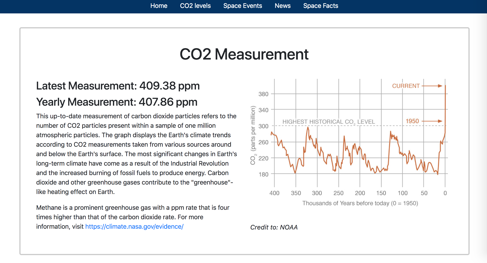

# State-of-the-World
The State of the World app gives users the an effective overview of the world’s condition at any given time. This app uses jQuery, Moment.js, interact.js, and AJAX to retrieve and display up-to-date environmental and political data. Using an API from HQCasanova, our app gets carbon dioxide rates and atmospheric data as they are recorded in the NOAA's Mauna Loa Observatory. The app also provides a multi-date countdown to upcoming space events for the user to view in the sky. We use an API from the New York Times to provide the event dates and a relevant article about the upcoming or current event. A Drag & Drop astronomy quiz made with Interact.js is provided for users looking to expand their knowledge of space. Using a different API from the New York Times, the State of the World app displays the top 3 world news articles each day!

Unfortunately, the CO2 levels aren't loading on the live site, because git only uses API pulls from secure sites.
HQCasanova does not have an SSL, so the url has "http" instead of "https". Here is an image that displays its full functionality.
